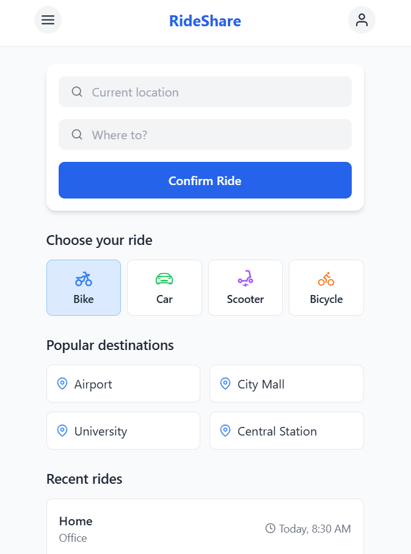

# RideShare App 🚗🏍️

A modern ridesharing application similar to Pathao/Uber built with React and Tailwind CSS.

 <!-- Add your screenshot later -->

## Features ✨

- Location search with autocomplete
- Multiple ride options (Bike, Car, Scooter, Bicycle)
- Popular destinations list
- Recent rides history
- Responsive mobile-first design
- Smooth animations and transitions

## Technologies Used 🛠️

- React 18
- Tailwind CSS 3
- React Icons
- PostCSS
- Vite (or Create-React-App)

## Installation ⚙️

1. Clone the repository:
```bash
git clone https://github.com/YOUR_USERNAME/rideshare-app.git
cd rideshare-app
```

2. Install dependencies:
```bash
npm install
```

3. Start development server:
```bash
npm run dev
# or if using Create-React-App:
npm start
```

4. Open in browser:
```
http://localhost:3000
```

## Project Structure 📁

```
rideshare-app/
├── public/          # Static files
├── src/
│   ├── assets/      # Images/icons
│   ├── components/  # React components
│   ├── App.js       # Main app component
│   └── index.js     # Entry point
├── tailwind.config.js
├── postcss.config.js
└── package.json
```

## Available Scripts 📜

```bash
npm start    # Start development server
npm run build  # Create production build
npm test     # Run tests
npm run lint  # Run linter
```

## Contributing 🤝

Pull requests are welcome! For major changes, please open an issue first.

## License 📄

[MIT](https://choosealicense.com/licenses/mit/)
